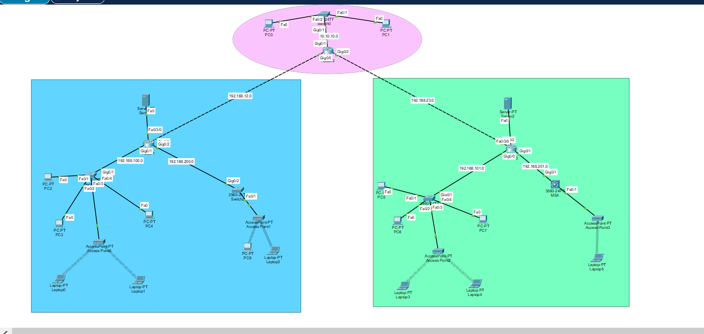
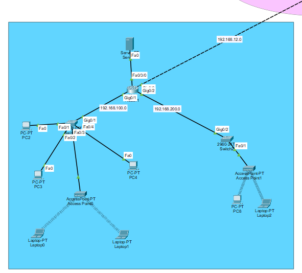
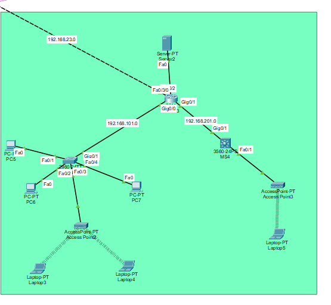

# SOFT.TECH — Enterprise Network Project

## 📌 Project Overview

This project demonstrates the design and implementation of a multi-site enterprise network for SOFT.TECH using Cisco Packet Tracer.

The network connects Headquarters (HQ), Branch 1, and Branch 2 using routers and switches. The project implements OSPF, DHCP, VLANs, Inter-VLAN Routing, Router-on-a-Stick, Extended ACLs, and wireless connectivity.

---

## 🏗️ Network Topology

### Complete Enterprise Network



---

## 🏢 HQ Network


---

## 🏢 Branch 1 Network



---

## 🏢 Branch 2 Network



---

## 🛠️ Technologies Used

- Cisco Packet Tracer
- Cisco IOS
- OSPF
- DHCP
- VLAN
- Inter-VLAN Routing
- Router-on-a-Stick
- Extended ACL
- Wireless Access Points
- IPv4

---

## 🔀 OSPF Dynamic Routing

OSPF is configured to provide dynamic routing between the enterprise routers.

- OSPF Process ID: 100
- Area: 0
- R1 Router ID: 1.1.1.1
- R2 Router ID: 2.2.2.2
- R3 Router ID: 3.3.3.3

---

## 🏷️ VLAN Configuration

VLANs are used to provide network segmentation between departments.

| VLAN | Department |
|---|---|
| VLAN 10 | IT |
| VLAN 20 | Sales |
| VLAN 30 | IT |
| VLAN 40 | HR |

---

## 🔄 Inter-VLAN Routing

Inter-VLAN communication is implemented using Router-on-a-Stick with 802.1Q subinterfaces.

Each VLAN uses a router subinterface as its default gateway.

---

## 📡 DHCP

DHCP is configured to automatically provide IP addressing information to network clients.

DHCP provides:

- IP Address
- Subnet Mask
- Default Gateway
- DNS Server

---

## 🔐 Extended ACL Security

Extended Access Control Lists are implemented to control traffic between selected network segments.

ACL policies are used to restrict unauthorized traffic while allowing permitted communication.

---

## 📶 Wireless Network

Wireless Access Points are integrated into the enterprise network to provide connectivity for wireless devices such as laptops.

---

## 🧪 Network Verification

The following Cisco IOS commands are used to verify the network:

```text
show ip interface brief
show ip route
show ip ospf neighbor
show ip protocols
show ip dhcp binding
show vlan brief
show interfaces trunk
show access-lists
```
## 📦 Cisco Packet Tracer Project

The complete Cisco Packet Tracer project is included in this repository.

### Download / Open the Project

[📥 Open PROJECT (SOFT.TECH).pkt](configs/PROJECT%20(SOFT.TECH).pkt)

> **Note:** Cisco Packet Tracer is required to open the `.pkt` file.

